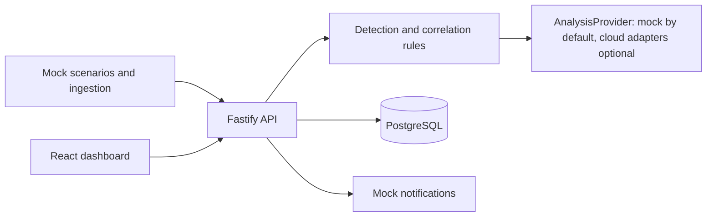

# Nikita Implementation Plan

## 1. Project Audit

This repository contains the source materials for the coursework project "AI-agent helper for application monitoring" for Cloud.ru. At the start of implementation there was no application source code, package manifest, backend, frontend, database schema, Docker config, CI, or tests. The only runnable artifact was a self-contained HTML prototype:

- `Triage MVP - _ _.html` - clickable UX prototype for repeated CustDev interviews.
- `Инструкция по макету .rtf` - instructions for the prototype and validation questions.
- `Курсовой_проект_исследовательская_часть.docx` - current research source of truth.
- `Структура практической части .xlsx` - current practical work plan and responsibility split.
- `Кейс Cloud.ru для ВШЭ_Этап_Discovey_v2.docx` - original customer case brief.
- `Встреча с заказчиком Cloud.ru 23 марта.docx` - customer clarification transcript.
- `Презентация_защита_30_апреля.pptx.pdf` and `Защита.docx` - defense summary artifacts.
- `Вопросы к заказчику.md` and `Вопросы к встрече 23.03.docx` - preparation materials, useful as context but not final requirements.
- `Дополнительная информация по КП.pdf` and `Метод_указания_Курсовой_проект_2026_v5.pdf` - methodology/context materials.
- `tmp/` - generated preview artifacts and local scratch output; excluded from Git.

Git state before implementation: the project folder was not an independent Git repository. The configured GitHub repository `https://github.com/egrvn/coursework` was empty, with no branches or commits. Implementation is isolated on `test/nikita-coursework-implementation`.

## 2. Nikita Scope

The practical plan assigns these items to Nikita:

- Block 8: backend development, including mock metric ingestion, anomaly detection rules, LLM wrapper for explanation/recommendation generation, REST API for UI, and basic CI.
- Block 9: frontend dashboard development together with Oksana: metrics dashboard, incident feed with AI analysis, settings page for alerts and integrations in mock mode.
- Block 10: integration and e2e assembly: connect backend, frontend, and mock data; run demo scenarios end-to-end on a stand.

Relevant customer and research requirements:

- Work above existing monitoring tools, not replace Prometheus, ELK, Grafana, or customer observability stacks.
- Support web applications only.
- Use mock/synthetic data for the coursework prototype; real production data is not required.
- Show compatibility with Prometheus-like metrics and ELK-like logs.
- Provide simple notification semantics for messengers/email, but real Telegram/SMTP integration is not required for MVP.
- Use cloud APIs for AI functions, but keep the default demo runnable without secrets.
- Keep freemium-compatible product logic: basic monitoring/incident view is not paywalled.
- Core Release 1 value is reactive incident triage: auto-summary, root-cause hypothesis, deploy correlation, and explainability.
- Proactive prevention is Release 2 after additional H4 validation and is out of implementation scope.
- AI must remain human-in-the-loop: no automatic remediation in MVP.

## 3. Chosen Stack

The project has no existing implementation stack, so the implementation uses a maintainable full-stack TypeScript monorepo:

- Frontend: React, Vite, TypeScript, TanStack Query, Recharts, lucide-react.
- Backend: Node.js 20, Fastify, TypeScript, Zod.
- Shared contracts: Zod schemas and inferred TypeScript types in a shared package.
- Database: PostgreSQL with Prisma migrations.
- Local runtime: Docker Compose for PostgreSQL plus app commands.
- Deployment: single production Docker image, ready for Cloud.ru Container Apps; PostgreSQL can be Cloud.ru Managed PostgreSQL.

Why this stack:

- One language across frontend, backend, and shared API contracts.
- Good fit for dashboard/API MVP without heavy framework overhead.
- Easy to demonstrate and defend during coursework review.
- Docker-first deployment fits Cloud.ru infrastructure.
- PostgreSQL keeps a realistic path to pilot data while remaining simple locally.

## 4. Architecture

The MVP is an overlay assistant for incident triage:

Main modules:

- `apps/api/src/modules/scenarios` - demo scenario catalog and scenario runner.
- `apps/api/src/modules/ingest` - mock ingestion endpoints for alerts, metrics, logs, and deploy events.
- `apps/api/src/modules/incidents` - incident lifecycle, incident details, feedback.
- `apps/api/src/modules/analysis` - rule detection, deploy correlation, AI provider interface, mock provider.
- `apps/api/src/modules/settings` - mock integration and alert settings.
- `apps/web/src/features/dashboard` - operational overview and scenario runner.
- `apps/web/src/features/incidents` - incident queue, incident detail, explainability drawer.
- `apps/web/src/features/settings` - mock provider/integration settings.
- `packages/shared/src` - API schemas and shared types.

## 5. Data Model

PostgreSQL tables:

- `Service`: monitored web service metadata.
- `Scenario`: demo scenario definition.
- `Incident`: status, severity, service, timestamps, AI summary, hypothesis, confidence, next step.
- `MetricPoint`: Prometheus-like metric samples attached to incident/scenario.
- `LogEvent`: ELK-like log rows attached to incident/scenario.
- `DeployEvent`: release/deploy events used for root-cause correlation.
- `AnalysisEvidence`: references proving each AI claim; can point to metric, log, or deploy event.
- `IncidentFeedback`: human-in-the-loop feedback for validation metrics.
- `IntegrationSetting`: mock state for Prometheus, ELK, Slack/Telegram/email, and LLM provider.

This is not a time-series database. It stores demo slices and evidence needed for the MVP.

## 6. API Contracts

REST endpoints:

- `GET /api/health`
- `GET /api/scenarios`
- `POST /api/scenarios/:id/run`
- `GET /api/incidents`
- `GET /api/incidents/:id`
- `POST /api/incidents/:id/analyze`
- `POST /api/incidents/:id/feedback`
- `GET /api/settings/integrations`
- `PATCH /api/settings/integrations`
- `POST /api/ingest/alerts`
- `POST /api/ingest/metrics`
- `POST /api/ingest/logs`
- `POST /api/ingest/deploys`

API responses must include structured validation errors and never expose secrets.

## 7. UI Screens

The UI should be a working operations console, not a landing page:

- Dashboard: service health, active incidents, scenario runner, key metrics, latest notification.
- Incident detail: summary, hypothesis, confidence, affected service, deploy timeline, evidence references, "Explain why" drawer, feedback controls.
- Settings: mock integration status for Prometheus, ELK, messenger/email, LLM provider mode, alert thresholds.

Design direction:

- dense but readable DevOps dashboard;
- restrained palette with clear semantic colors for critical/warning/healthy states;
- no marketing hero, no decorative cards, no artificial AI hype copy;
- controls must be obvious and runnable during defense.

## 8. Deployment Plan

Local:

1. Copy `.env.example` to `.env`.
2. Start PostgreSQL with Docker Compose.
3. Run Prisma migrations and seed data.
4. Run API and web dev servers.
5. Use the dashboard to run demo scenarios.

Docker:

- Build one production image.
- API serves `/api/*` and static frontend files.
- Container exposes `PORT`, default `8080`.

Cloud.ru:

- Push image to Artifact Registry.
- Run image in Container Apps with env vars.
- Use Managed PostgreSQL for `DATABASE_URL`.
- Configure health check at `/api/health`.
- Run migrations as a one-off deploy step, not as hidden application startup logic.

## 9. Testing and Quality Gates

Required checks before handoff:

- Unit tests for anomaly detection, deploy correlation, low-confidence fallback, feedback validation.
- API tests for scenario run -> incident -> analysis -> evidence -> feedback.
- Frontend tests for dashboard render, scenario run, incident view, explainability drawer.
- Build checks: typecheck, lint, test, frontend build, Docker build.
- Local smoke check: API health and web UI open successfully.

Acceptance criteria:

- The app runs from a clean checkout using documented commands.
- Demo scenario "release regression / 5xx spike" works end-to-end.
- AI output is explainable with concrete metric/log/deploy evidence.
- Low-confidence scenario does not hallucinate a confident root cause.
- Documentation clearly maps implementation to Nikita's tasks and research requirements.

## 10. Risks and Open Questions

- The GitHub repository is empty. If GitHub requires an existing base branch for PR creation, PR preparation will be blocked until `main` exists. Implementation must not push functional work directly to `main`.
- Real Cloud.ru deployment cannot be fully verified without project credentials, registry access, and Managed PostgreSQL credentials.
- Real LLM providers require secrets and legal/security review; default implementation remains mock/rules-based.
- Real Prometheus/ELK/Telegram integrations are intentionally out of scope for this MVP.
- Mock datasets from the practical plan belong mostly to Sasha's task. This implementation includes minimal seed scenarios only to make Nikita's backend/frontend/e2e scope runnable.
